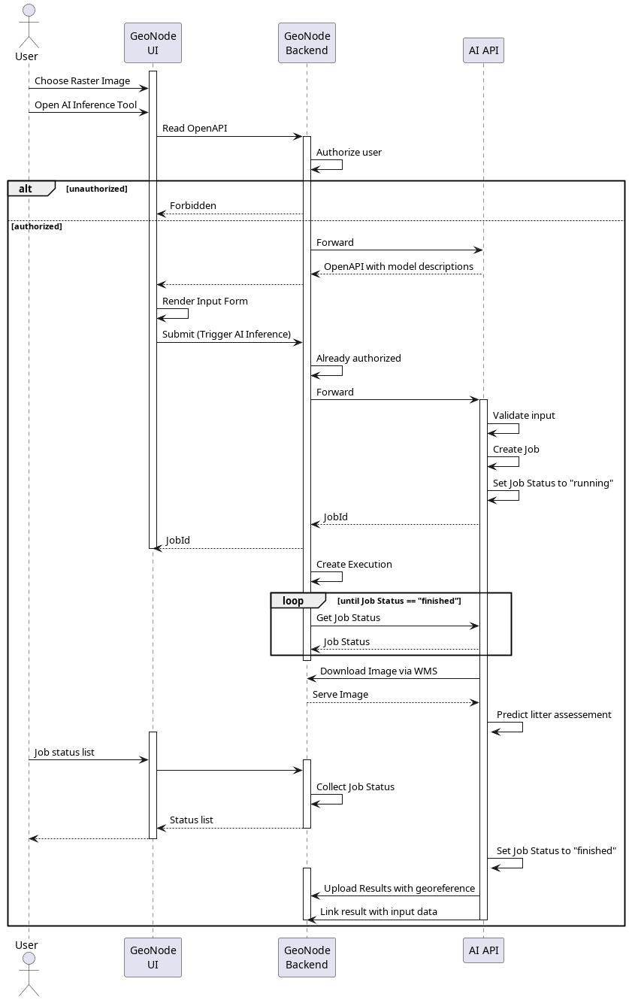

# AI-Inference REST API for GeoNode

## Status

- [x] First version using flask
- [x] Upload GeoNode: Done
- [x] swagger ui: started/ up to date
  - [X] Integrate multiple models: in progress (currently 4 models)
- Suggest Change to Linux (Ubuntu): postponed
- [x] Create Dockerfile
- [x] Make things asynchronous
- [x] Migrate to FastAPI
- [X] Make local tests working again
- [X] Migrate Dockerfile

## Installation

This project uses `poetry` which creates a virtual environment during installation.
Make sure the appropriate PyTorch packages are installed already (e.g. servers with GPUs installed) or the CPU-related packages are installed from <https://download.pytorch.org/whl/cpu> .

## Getting Started

### Add your own models

Check out the [Add new AI inference docu](./Add_new_ai_inference.md).

### Get the Models

[Download the models](https://cloud.dfki.de/owncloud/index.php/s/rQWsqfktx2drabb) and copy them to `./models`.

### Start the AI-Inference REST API

Install the app by using `poetry`:

```bash
poetry install
```

You can use the "--with" operator to install CPU-based pytorch libraries:

```bash
poetry install --with pytorch
```

Start the app (on port `5000` in this case):

```bash
uvicorn main:app --port 5000
```

or start the app via poetry script:

```bash
poetry run app
```

The REST API (OpenAPI description) is available under `http://localhost:5000/docs`.
Check the [uvicorn documentation](https://www.uvicorn.org/) for more information about productive deployment.
Here is a quick overview of the endpoints:

- `/models/`: a list of all available models
- `/jobs/`: a list of all jobs
- `/jobs/<job_id>`: Status of a job with id `job_id`
- `/models/<model_name/`: Predict call for a model with name `model_name`

Some models need specific input.
Have a look at the OpenAPI documentation for details.

## Folders

### inference

Contains subpackages for all inference implementations.
Each subpackage has an inference file containing several things:

- A REST route to that model
- Some model metadata
- An implementation of `ModelInference`

The app will take care of finding, warming and calling model inferences automatically.
Each inference is assigned a `Job` which runs in the background.
Use either `/jobs/` or `/jobs/<job_id>` to get information about the job status.

## Intended Workflow



## Authors

Felix Becker <felix.becker@dfki.de>

Henning Bredel <h.bredel@52north.org>

## Credits

This package was created with [Cookiecutter](https://github.com/audreyr/cookiecutter) and the [waynerv/cookiecutter-pypackage](https://github.com/waynerv/cookiecutter-pypackage) project template.
