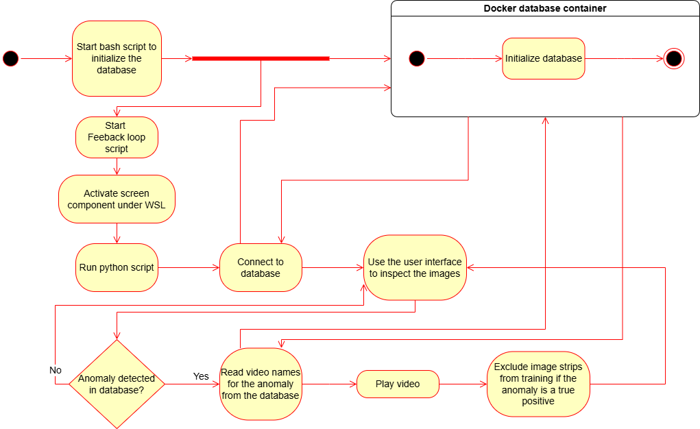
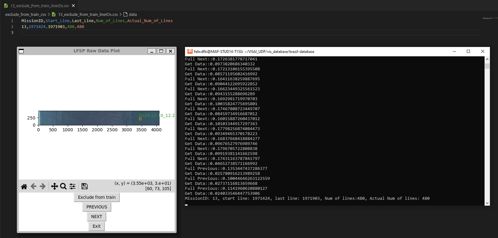
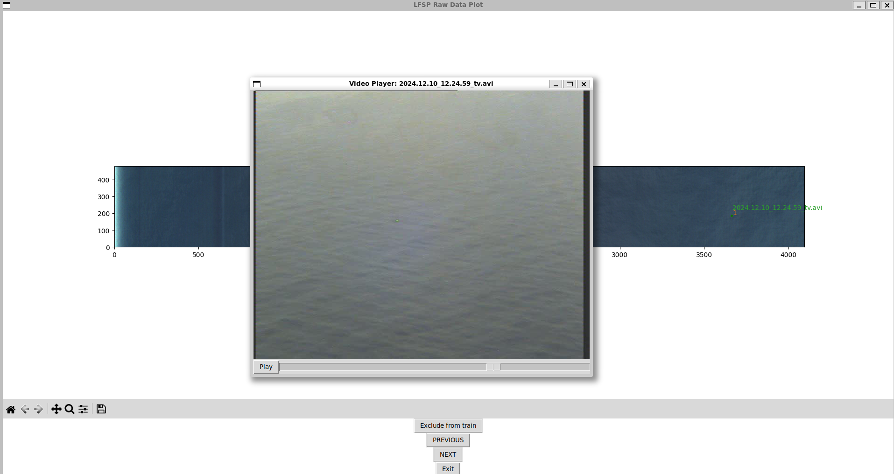

# Feedback Loop

## Status

* documentation: in progress
* EOIR AI: done
* VIS AI: done

We might add new model files if needed?

## table of contents

1. Get started
1. What is a feedback loop?
1. Documentation
1. Authors

## Get started

You can check out the Feedback Loop Tool in the future. It is not publicly available at the moment.

## Technical terms

| **Abbreviation** | **Definition**                                                                 |
|------------------|---------------------------------------------------------------------------------|
| CSS              | Candidate Selection System                                                      |
| BMUV             | Bundesministerium für Umwelt, Naturschutz, nukleare Sicherheit und Verbraucherschutz |
| EOIR             | Electro Optic and Infra-Red Camera                                              |
| EOIR AI          | AI for the EOIR image data                                                      |
| GIS              | Geographic Information System                                                   |
| VIS              | Visual spectrum                                                                 |
| VIS AI           | AI for the VIS line scanner data                                                |
| VAE              | Variational Autoencoder (Model for the VIS AI)                                 |

## What is a feedback loop?

The feedback loop is based on data from previous flights. During a flight, this data is written to a database. The purpose of the feedback loop is to validate the VIS AI. Based on database entries from past flights, experts can validate the model. Then, the knowledge base can be expanded and the model improved using the experts' findings. The script reads image lines from the database and displays them to the expert. The display shows the detected anomalies as points in the image, and for each point, there is a reference to the EOIR video so the anomaly can be re-validated at a higher resolution. Experts annotate image strips in which anomalies were correctly detected (true positives). These strips are not sent to the VIS AI for retraining. Image strips in which no anomalies were detected (true negatives) or in which one or more anomalies were incorrectly detected (false positives) are sent to the VIS AI for training in the next step.

*Feedback Loop in a diagram*

## Documentation

As mentioned before we take the databases form previous flights and load them with a GUI tool which is developed in tkinter. The following figures illustrate the described functionality using screenshots of the feedback loop tool. The first figure shows how excluded image lines are written back to a CSV file. The second figure shows the automatic playback of a video for a detected anomaly, if a video file is available.

*Feedback Loop tool writes true postives to csv file*

*The Feedback Loop tool plays the EOIR video from the detected anomaly*

## Authors

Felix Becker, DFKI
